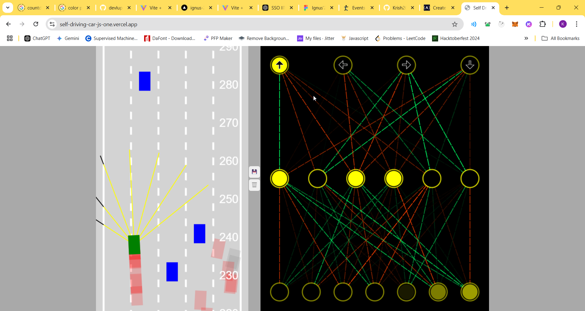

# Self Driving Cars Simulation 🚗

A JavaScript-based self-driving car simulation that demonstrates neural networks and machine learning concepts in action.

## Disclaimer
This project is based on the excellent course by Dr. Radu Mariescu-Istodor. The implementation follows his teaching methodology while incorporating personal modifications and improvements.

## Features
- 🤖 Neural network implementation for car decision making
- 🎮 Interactive controls for manual and autonomous driving
- 🚦 Traffic simulation with multiple autonomous vehicles
- 🛣️ Custom road generation and editing
- 📡 Sensor system for obstacle detection
- 💾 Save/Load functionality for trained models
- 🎨 Real-time visualization of neural network decisions

## Getting Started

### Prerequisites
- Modern web browser (Chrome/Firefox recommended)
- Basic understanding of JavaScript

### Installation
1. Clone the repository:
```bash
git clone https://github.com/yourusername/self-driving-cars-simulation.git
```

2. Navigate to the project directory:
```bash
cd self-driving-cars-simulation
```

3. Open `index.html` in your web browser to start the simulation.

## Screenshot

### Traffic Simulation



## Contributing
We welcome contributions to improve this self-driving car simulation!

### How to Contribute
1. Fork the repository
2. Create your feature branch (`git checkout -b feature/AmazingFeature`)
3. Commit your changes (`git commit -m 'Add some AmazingFeature'`)
4. Push to the branch (`git push origin feature/AmazingFeature`)
5. Open a Pull Request

### Code Style Guidelines
- Use meaningful variable and function names
- Comment your code where necessary
- Follow the existing code structure
- Test your changes thoroughly before submitting

For major changes, please open an issue first to discuss what you would like to change.
